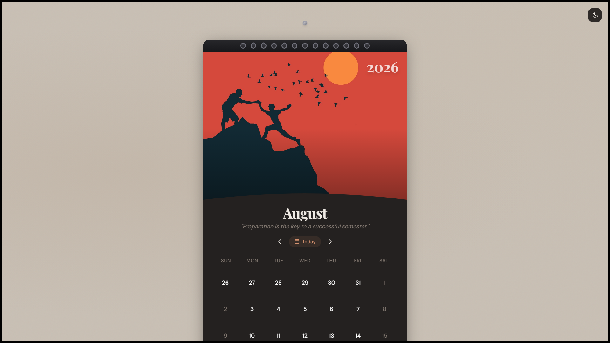
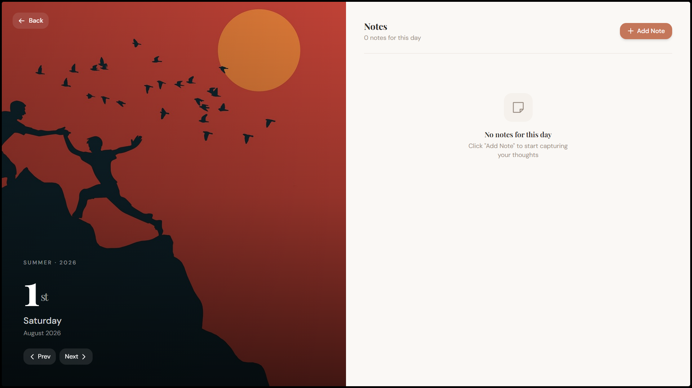

# Calendar Component - takeUforward




## Features

### Core
- **Wall Calendar Aesthetic** - Spiral binding, hanging nail + string, textured wall background, and page-flip animations that mimic a physical calendar.
- **Day Range Selector** - Click once to select a start date, click again to complete a range. Visual indicators for start, end, and in-between dates with a pill showing the total notes in that range.
- **Integrated Notes** - Full CRUD note system attached to individual dates. Notes support titles, rich content, image attachments (with client-side compression), and custom color-coded categories.
- **Fully Responsive** - Mobile-first layout. Calendar grid, day detail view, and note editor all gracefully adapt between mobile and desktop.

### Extras
- **Dark / Light Mode** — Theme toggle with system preference detection and `localStorage` persistence. Wall background remains consistent across themes.
- **Page-Flip Animations** — 3D perspective-based month transitions with Framer Motion.
- **Keyboard Navigation** — Arrow keys to move between dates, Shift+Arrow for months, Enter to open day detail.
- **Monthly Hero Images** — Season-aware imagery with accent color theming per month.
- **Motivational Quotes** — Month-specific quotes displayed below the month title.

---

## Architecture

```
app/
├── globals.css          # Design tokens + wall background
├── layout.tsx           # Root layout with Playfair Display + DM Sans
└── page.tsx             # Entry → CalendarShell

components/
├── calendar/
│   ├── CalendarShell    # Root orchestrator — state, routing, keyboard
│   ├── CalendarGrid     # 7-column grid with week grouping
│   ├── DayCell          # Individual day with selection, holiday, note dots
│   ├── DayDetailView    # Full-screen day view with hero + notes list
│   ├── DateRangeIndicator # Range pill with note count
│   ├── MonthNavigation  # Prev/Next/Today controls
│   ├── NoteEditor       # Modal CRUD form with image upload
│   ├── NoteItem         # Note card with edit/delete/view
│   └── ThemeToggle      # Animated sun/moon toggle
└── ui/                  # shadcn/ui primitives

hooks/
├── useCalendar          # Month/year state + day generation
├── useDateRange         # Selection state machine (idle → selecting → selected)
├── useNotes             # CRUD + localStorage persistence + range counting
└── useTheme             # Theme state + system preference + DOM class toggling

lib/
├── calendar-utils       # Date math, formatting, holidays, quotes
├── constants            # Weekdays, months, holidays, categories, colors
├── month-images         # Per-month image paths, seasons, accent colors
└── utils                # cn() helper (clsx + tailwind-merge)
```

### Design Decisions

| Decision | Rationale |
|---|---|
| **Custom hooks over Context** | Each hook manages its own domain (calendar, dates, notes, theme) with clean boundaries. Context would add unnecessary nesting for a single-page app. |
| **localStorage for persistence** | Meets the PRD's "no backend" constraint while still giving real persistence across sessions. |
| **Framer Motion over CSS animations** | Enables gesture-aware, spring-based, layout-animated transitions that CSS alone cannot express (e.g., 3D page flips, exit animations, staggered lists). |
| **Tailwind v4 design tokens** | All calendar colors defined as CSS custom properties (`--cal-*`) in `:root` / `.dark`, enabling instant theme switching without JS re-renders. |
| **shadcn/ui primitives** | Accessible, unstyled base components (Dialog, AlertDialog, Tooltip, Input, Textarea) that integrate naturally with the custom design system. |
| **Client-side image compression** | Note images are resized to max 800×800 and compressed to JPEG 60% via Canvas API before storing in `localStorage`, preventing storage quota issues. |
| **Solid wall background** | A fixed, theme-agnostic muted tone (`#C8BFB4`) with subtle radial gradients and SVG noise creates a realistic wall texture without large image downloads. |

---

## Getting Started

### Prerequisites

- **Node.js**
- **npm** (ships with Node.js)

### Install & Run

```bash
# Clone the repository
git clone https://github.com/udaykumar-dhokia/takeUforward-calendar-component.git
cd calendar

# Install dependencies
npm install

# Start development server
npm run dev
```

Open **[http://localhost:3000](http://localhost:3000)** in your browser.

### Production Build

```bash
npm run build
npm start
```

---

## Tech Stack

| Layer | Technology |
|---|---|
| Framework | [Next.js 16](https://nextjs.org) (App Router) |
| Language | TypeScript |
| Styling | [Tailwind CSS v4](https://tailwindcss.com) |
| Components | [shadcn/ui](https://ui.shadcn.com) + [Radix UI](https://www.radix-ui.com) |
| Animations | [Framer Motion](https://www.framer.com/motion) |
| Icons | [Phosphor Icons](https://phosphoricons.com) |
| Fonts | [Playfair Display](https://fonts.google.com/specimen/Playfair+Display) (headings) + [DM Sans](https://fonts.google.com/specimen/DM+Sans) (body) |

---

## Responsive Breakpoints

| Viewport | Behavior |
|---|---|
| **Mobile** (< 640px) | Stacked layout, compact day cells, swipe-friendly day detail |
| **Tablet** (640–1024px) | Slightly wider calendar card, more spacing |
| **Desktop** (> 1024px) | Day detail splits into side-by-side hero + notes panel |

---

## Keyboard Shortcuts

| Key | Action |
|---|---|
| `←` / `→` | Move selection by one day |
| `↑` / `↓` | Move selection by one week |
| `Shift + ←` / `→` | Navigate to previous / next month |
| `Enter` | Open day detail for selected date |
| `Escape` | Close day detail view |

---